# Gestor de Postulaciones y Tareas

**Autor:** Ian Gorski

---

## 🌟 Motivación

Buscar trabajo puede ser una tarea desafiante, estresante y muchas veces desmotivadora. Este proyecto nació a partir de la necesidad de una amiga de hacer el seguimiento de sus postulaciones laborales de una forma más divertida y agradable. El objetivo es acompañar y transformar ese proceso en una experiencia positiva, visualmente atractiva y motivadora, facilitando la organización y el registro de avances.

---

## 🎯 Objetivo

Desarrollar una aplicación moderna y amigable para gestionar postulaciones y tareas, permitiendo organizar información, adjuntar currículums y realizar búsquedas rápidas. Está dirigida a personas, equipos o instituciones que necesiten administrar procesos de selección, seguimiento de tareas o gestión documental de manera sencilla y eficiente.

---

## 👀 Vista previa

A continuación se muestran capturas de las principales secciones y funcionalidades de la aplicación:

### 1. Pantalla de inicio / Splash
Muestra la bienvenida y la frase motivacional.
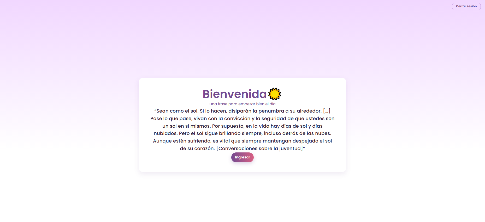

### 2. Login y Registro
Visualiza el diseño y la experiencia de autenticación.
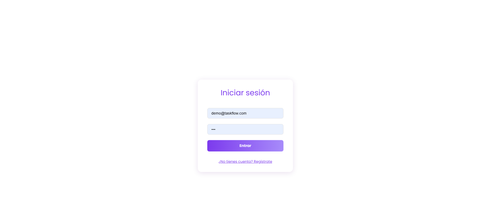
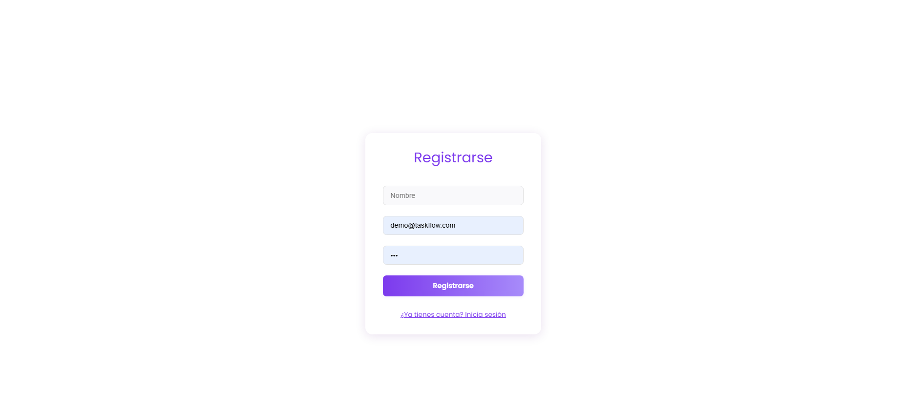

### 3. Panel principal / Dashboard
Donde se ven las postulaciones y tareas.
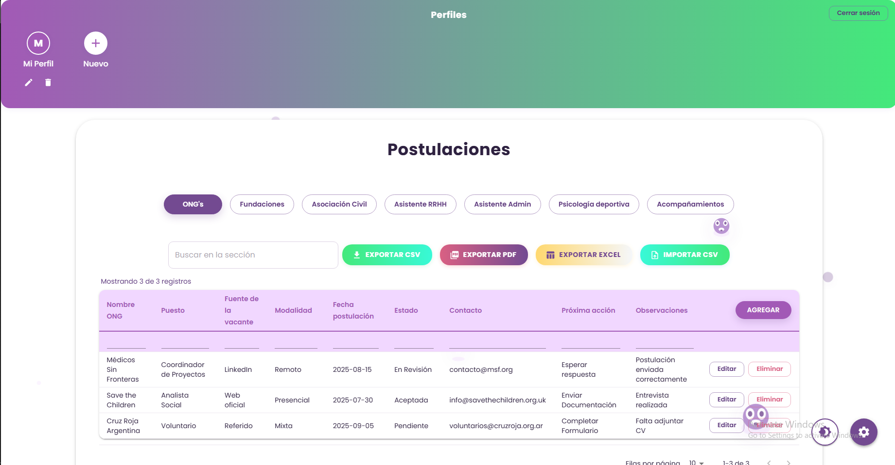
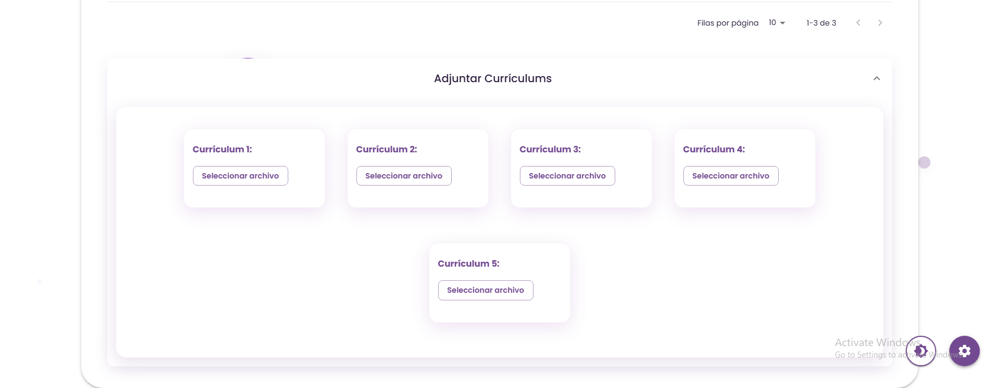

### 4. Tabla de postulaciones
Muestra el CRUD, filtros, paginación y exportaciones.
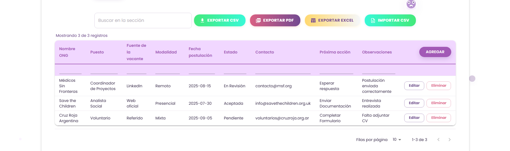

### 5. Animaciones o fondos personalizados
Si tienes animaciones, partículas o fondos visuales.
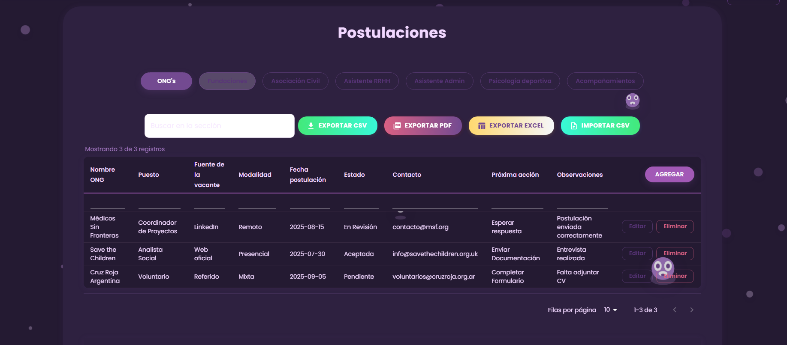

### 6. Modal de confirmación / Alertas
Ejemplo de feedback visual y confirmaciones.
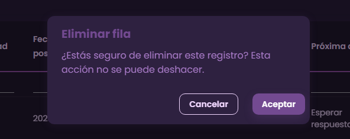
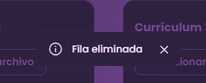

### 7. Modo oscuro / Personalización de tema
Muestra el cambio de tema si está implementado.
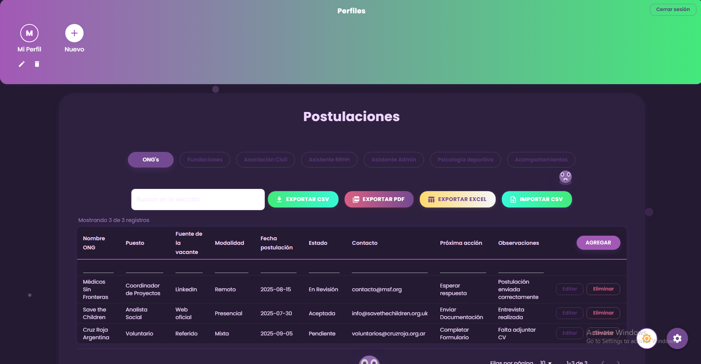
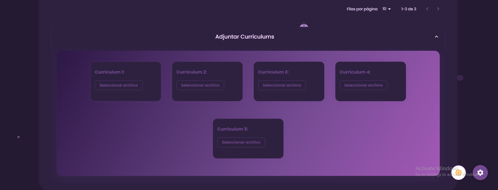

### 8. Vista móvil / responsive
Capturas de cómo se ve en dispositivos móviles:


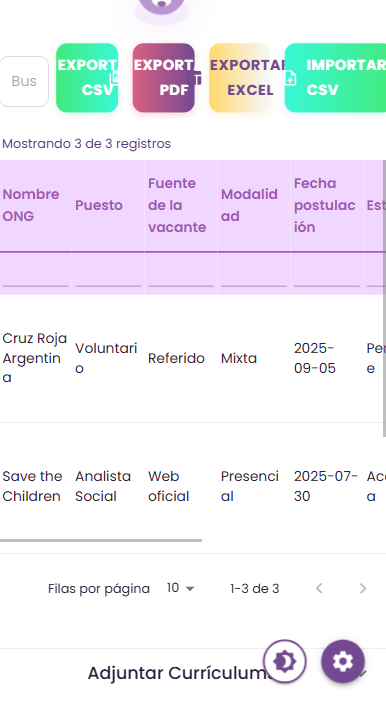
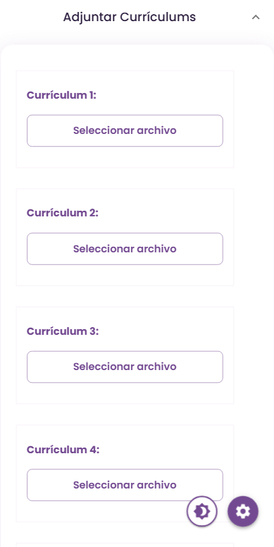

### 9. Exportación a PDF/Excel/CSV
Muestra el resultado de una exportación:

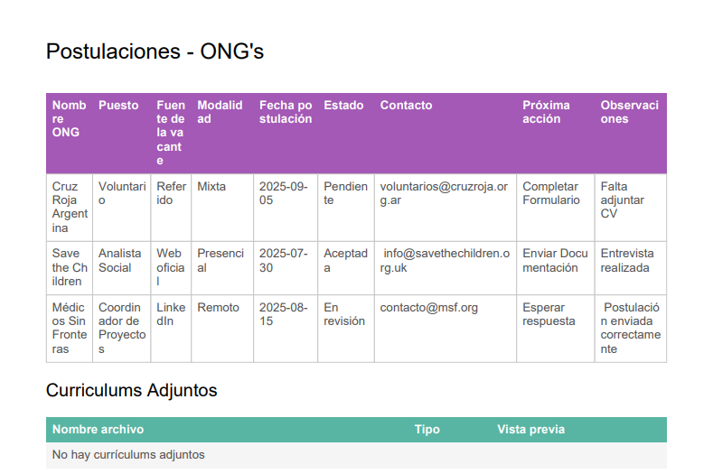


### 10. Cualquier sección especial o funcionalidad destacada
Ejemplo: tutorial interactivo, perfil de usuario, etc.:

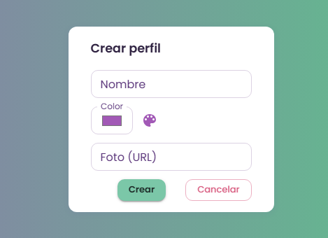
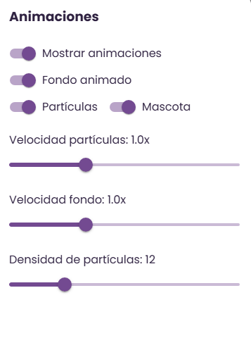
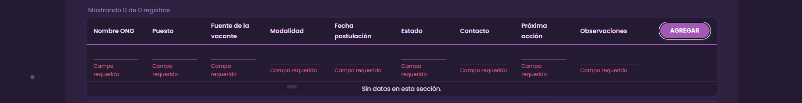


### 🛠️ Tecnologías utilizadas:

- React
- Vite (bundler y servidor de desarrollo)
- Material UI (MUI)
- Framer Motion
- CSS personalizado
- JavaScript (ES6+)
- HTML5
- Node.js & npm (gestión de dependencias)
- ESLint (estilo y calidad de código)
- Testing Library (tests unitarios)
- LocalStorage (persistencia)
- Herramientas de internacionalización (i18n)
- Herramientas de exportación (PDF, Excel, CSV)
- Git & GitHub (control de versiones)

---

## 🚀 Instalación

1. Clona el repositorio:
	```bash
	git clone https://github.com/tu-usuario/gestor-tareas.git
	```
2. Ingresa a la carpeta del proyecto:
	```bash
	cd gestor-tareas
	```
3. Instala las dependencias:
	```bash
	```
4. Ejecuta el proyecto en modo desarrollo:
    ```bash
    npm run dev
    ```
    

## 📁 Estructura del Proyecto

```
Gestor tareas/
├── public/
│   └── cursor-perrito.svg
├── src/
│   ├── App.jsx
│   ├── App.css
│   ├── main.jsx
│   ├── index.css
│   ├── theme.js
│   ├── components/
│   │   ├── auth/
│   │   │   ├── LoginForm.jsx
│   │   │   ├── LoginForm.css
│   │   │   ├── RegisterForm.jsx
│   │   │   ├── RegisterForm.css
│   │   ├── perfiles/
│   │   │   ├── ProfileSelector.jsx
│   │   │   ├── ProfileSelector.css
│   │   ├── curriculums/
│   │   │   ├── CurriculumSection.jsx
│   │   │   ├── CurriculumSection.css
│   │   ├── postulaciones/
│   │   │   ├── PostulacionesTable.jsx
│   │   │   ├── PostulacionesTable.css
│   │   ├── SplashScreen.jsx
│   │   ├── SplashScreen.css
│   │   ├── AnimatedCube.jsx
│   │   ├── AnimatedCube.css
│   │   ├── InteractiveHummingbird.jsx
│   │   ├── InteractiveHummingbird.css
│   │   ├── ConfirmDialog.jsx
│   │   ├── ConfirmDialog.css
│   │   ├── AnimatedAlert.jsx
│   │   ├── AnimatedAlert.css
│   │   ├── AnimatedBackground.jsx
│   │   ├── AnimatedBackground.css
│   │   ├── ParticlesBackground.jsx
│   │   ├── ParticlesBackground.css
│   │   ├── AnimationControlPanel.jsx
│   │   ├── AnimationControlPanel.css
│   ├── styles/
│   │   ├── global.css
│   │   ├── animatedBackground.css
│   │   ├── particles.css
│   ├── constants/
│   │   ├── quotes.js
│   │   ├── sections.js
│   ├── context/
│   │   ├── AuthContext.jsx
│   │   ├── ThemeModeContext.jsx
│   ├── data/
│   │   ├── quotes.js
│   ├── hooks/
│   │   ├── useCurriculums.js
│   │   ├── usePostulaciones.js
│   ├── i18n/
│   │   ├── en.json
│   │   ├── es.json
│   ├── routes/
│   │   ├── AppRoutes.jsx
│   ├── services/
│   ├── tests/
│   ├── types/
│   ├── utils/
│   │   ├── notify.js
│   │   ├── validations.js
├── index.html
├── vite.config.js
├── README.md
├── backups/
│   └── ...
├── screenshots/
│   └── ...
```

---

## 📄 Licencia

Este proyecto se distribuye bajo la licencia MIT. Puedes consultar el archivo LICENSE para más detalles.
## 🗺️ Roadmap

## 🎯 Objetivo del proyecto
Aplicación para gestionar postulaciones y tareas, permitiendo organizar información, adjuntar currículums y realizar búsquedas rápidas. Dirigido a personas, equipos o instituciones que necesiten administrar procesos de selección, seguimiento de tareas o gestión documental de manera sencilla y moderna.

## 📊 Estado actual del proyecto
**MVP listo** (Producto Mínimo Viable funcional, listo para mostrar y seguir ampliando)

## 🔗 Enlaces útiles
- Demo online: *(pendiente de publicación)*
- Documentación: *(pendiente de ampliación)*
- Contacto: [gorskiandev@gmail.com](mailto:gorskiandev@gmail.com)

---

## 🗺️ Hoja de Ruta

### Funcionalidades Implementadas
- ✅ Pantalla Splash centrada con frase motivacional aleatoria
- ✅ Navegación por secciones (no sticky, centrada)
- ✅ CRUD completo de postulaciones/tareas (agregar, editar, borrar)
- ✅ Validaciones de campos (obligatorios, email, fecha)
- ✅ Persistencia local por sección (localStorage)
- ✅ Búsqueda insensible a acentos
- ✅ Paginación y scroll interno en tablas grandes
- ✅ Feedback visual: Snackbar, alertas, confirmaciones
- ✅ Animaciones de entrada (Framer Motion)
- ✅ Fondos animados y partículas
- ✅ Estilo personalizado con Material UI y CSS
- ✅ Componentes y hooks reutilizables
- ✅ Separación de constantes y datos

---

### ✨ Mejoras de Front-End Implementadas

- ✅ Pantalla Splash centrada con frase motivacional aleatoria
- ✅ Navegación por secciones (no sticky, centrada)
- ✅ CRUD completo de postulaciones/tareas (agregar, editar, borrar)
- ✅ Validaciones de campos (obligatorios, email, fecha)
- ✅ Persistencia local por sección (localStorage)
- ✅ Búsqueda insensible a acentos
- ✅ Paginación y scroll interno en tablas grandes
- ✅ Feedback visual: Snackbar, alertas, confirmaciones
- ✅ Animaciones de entrada (Framer Motion)
- ✅ Fondos animados y partículas
- ✅ Estilo personalizado con Material UI y CSS
- ✅ Componentes y hooks reutilizables
- ✅ Separación de constantes y datos
- ✅ Importar datos desde CSV
- ✅ Exportar a Excel
- ✅ Exportar a PDF (tablas completas, curriculums adjuntos, visualización alineada y sin cortes)
- ✅ Autenticación de usuario (login/logout, registro, uso personal)
- ✅ Notificaciones push (integradas en eventos clave, como agregar postulaciones)
- ✅ Modo oscuro y personalización de tema (fondo degradé, paleta violeta, toda la pantalla y componentes; con selector funcional)
- ✅ Accesibilidad (a11y)
- ✅ Optimización para móviles (responsive avanzado)

### ✨ Mejoras Front-End próximas a implementar

- [ ] **Adjuntar archivos adicionales:** Permite adjuntar otros tipos de archivos (imágenes, documentos Word, etc.) además de currículums, ampliando la capacidad documental de cada postulación/tarea.
- [ ] **Etiquetas y colores personalizados:** Permite asignar etiquetas o colores a postulaciones/tareas para una clasificación visual rápida, mejorando la organización y el seguimiento por categorías o estados.
- [ ] **Exportación personalizada:** Permite seleccionar qué columnas exportar o filtrar los datos antes de exportar a PDF/Excel/CSV, dando mayor control sobre la información compartida o archivada.
- [ ] **Ayuda interactiva o tutorial:** Incluye un pequeño tutorial interactivo para nuevos usuarios, mostrando las principales funciones y facilitando el onboarding.
- [ ] **Integración con calendario externo:** Permite exportar fechas importantes a Google Calendar o Outlook, ayudando a no perder de vista eventos clave y sincronizar la gestión con otras herramientas.

---

### 🖥️ Back-End y Distribución a implementar
- [ ] API RESTful y base de datos
- [ ] Autenticación segura (JWT, OAuth)
- [ ] Integración con servicios externos (Google Drive, Gmail, etc.)
- [ ] Despliegue en la nube (Heroku, Vercel, AWS)
- [ ] Convertir en aplicación de escritorio (Electron.js)
- [ ] Crear instalador para Windows/Linux/Mac
- [ ] Documentación para usuarios y desarrolladores
- [ ] Página de presentación/landing para el proyecto

---

### 🧩 Extras para el Portafolio a incluir
- [ ] Documentación técnica (arquitectura, decisiones, etc.)
- [ ] Guía de usuario (manual de uso)
- [ ] Tests automáticos (unitarios y de integración)
- [ ] CI/CD (automatización de despliegue)
- [ ] Demo online (Vercel, Netlify)
- [ ] Video demo y capturas de pantalla

---

## Mejoras recientes 🚀
- Modo oscuro ahora se puede alternar dinámicamente desde el icono, actualizando el tema y guardando preferencia en localStorage.
- Notificaciones push integradas: aparecen al agregar postulaciones y pueden ampliarse a otros eventos.
- Exportación PDF mejorada: tablas violetas completas y alineadas, curriculums adjuntos visualizados correctamente, sin textos de fallback.
- Espaciado y agrupación visual optimizados en PDF.
- Notificaciones unificadas: Snackbars temáticos (éxito/info/error) y ConfirmDialog MUI para acciones destructivas (eliminar fila, quitar CV).
- Lazy loading de piezas pesadas: tabla (PostulacionesTable), currículums (CurriculumSection), animaciones (fondos, partículas y colibrí) y App en rutas.
- Code splitting con Vite (manualChunks) separa React, MUI y Framer Motion para acelerar la carga inicial.
- Modo oscuro mejorado: fondo en degradé violeta oscuro, paleta personalizada, mucho más cómodo para la vista.
- El modo oscuro afecta toda la pantalla y los componentes, no solo las tablas.
- Recordatorio: el README se actualiza con cada mejora relevante para mantener la documentación al día.

## ▶️ Cómo ejecutar

- Instala las dependencias:  
    ```bash
    npm install
    ```
- Ejecuta el proyecto en modo desarrollo:  
    ```bash
    npm run dev
    ```
- Compila para producción:  
    ```bash
    npm run build
    ```

## 🛠️ Notas técnicas

- Tema MUI personalizado en `src/theme.js` (paleta morados/lilas, tipografía Poppins, sombras y bordes suaves).
- Reglas responsive y safe-area en `src/styles/global.css`.
- Confirmaciones: `src/components/ConfirmDialog.jsx`.
- Componentes diferidos: `src/components/ParticlesBackground.jsx`, `AnimatedBackground.jsx`, `InteractiveHummingbird.jsx`, `CurriculumSection.jsx`, `PostulacionesTable.jsx`.

---

## Notas
- La gestión de usuarios y roles no se implementa, ya que la app está pensada para uso personal y no multiusuario.
- La autenticación protege el acceso y los datos locales.
